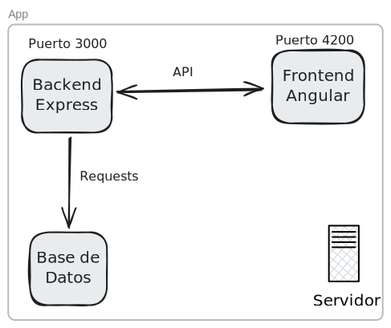
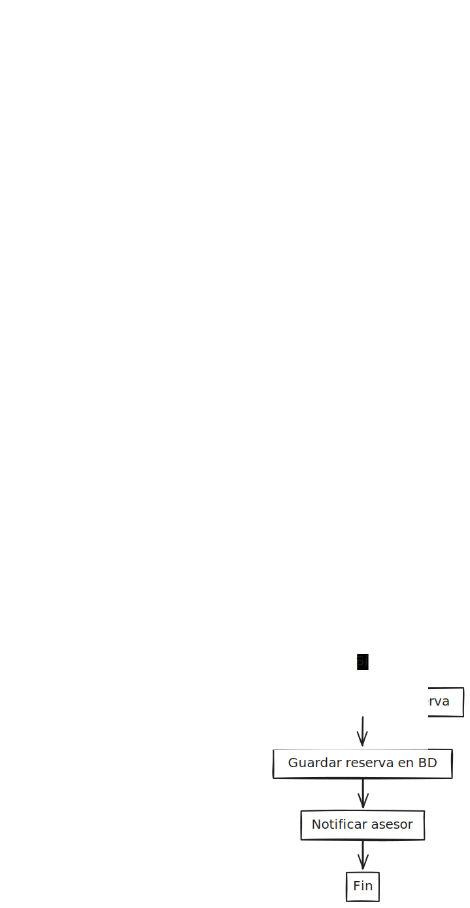
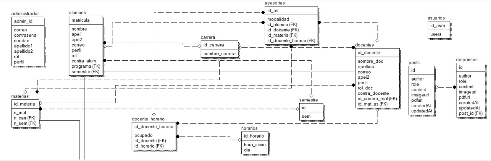
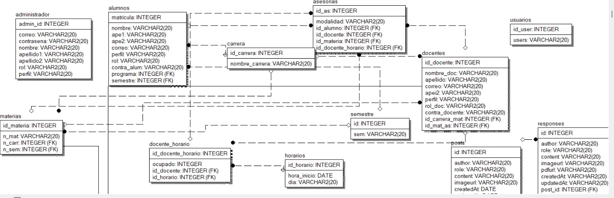

# Manual Tecnico

## 1. Introducción

> [!WARNING]
> La aplicacion es un proyecto académico y no debe ser utilizado en producción.

Esta es una aplicación web para agendar asesorías académicas con el nombre de `UACH_AS` (UACH Asesorías), compuesta por:

* **Backend**: Servidor REST construido con Node.js y Express, que expone una API para gestionar usuarios, horarios y reservas de asesorías.
* **Frontend**: Cliente desarrollado en Angular que consume la API para ofrecer la interfaz publica.
* **Base de datos**: Oracle Database 21c Express Edition para el almacenamiento de datos académicos y de asesorías.

## 2. Arquitectura general



* El **Frontend** se ejecuta por defecto en el puerto **4200**.
* El **Backend** escucha en el puerto **3000**.
* La comunicación entre Frontend y Backend se realiza vía peticiones HTTP.

## 3. Requisitos previos

1. **Git** (para clonar el repositorio).
2. **Node.js** y **npm** (para iniciar el proyecto).
3. **Oracle Database 21c Express Edition** (o compatible).

## 4. Instalación y configuración

### 4.1. Clonar el repositorio

```bash
git clone https://github.com/Chacon0754/asesorias-proyecto.git
cd asesorias-proyecto
```

### 4.2. Backend

1. Acceder al directorio del servidor:

```bash
cd Backend
```

2. Instalar dependencias:

```bash
npm install
```

3. Configurar la base de datos (a continuacion se muestra como configurarla usando un contenedor de Docker):

```sh
docker run -d --name oracle \
  -p 1521:1521 \
  -e ORACLE_PWD=pass \
  -v oracle_xe_data:/opt/oracle/oradata \
  container-registry.oracle.com/database/express:21.3.0-xe

docker exec -it oracle bash
sqlplus sys/pass as sysdba
```

Crear el usuario y la base de datos:

```sql
CREATE USER uach_as IDENTIFIED BY password;
GRANT DBA, RESOURCE TO uach_as;
```

Ahora deberia ser posible conectarse con el nuevo usuario:

```sh
sqlplus uach_as/password@localhost:1521/XEPDB1
```


4. Iniciar el servidor:

```bash
npm run start
```

### 4.3. Frontend

1. Acceder al directorio del cliente:

```bash
cd Frontend
```

2. Instalar dependencias:

```bash
npm install
```

3. Ejecutar la aplicación:

```bash
npm run start
```

Luego abre en el navegador `http://localhost:4200`.



## 5. Base de datos

1. Crear las tablas necesarias (esquema de ejemplo, utilizar `script.sql`):

```sql
CREATE TABLE docentes (
    id_docente         INTEGER PRIMARY KEY,
    nombre_doc         VARCHAR2(100),
    apellido           VARCHAR2(100),
    correo             VARCHAR2(100),
    apei2              VARCHAR2(100),
    perfil             VARCHAR2(255),
    rol_doc            VARCHAR2(50),
    contra_docente     VARCHAR2(255),
    id_carrera_mat     INTEGER,
    id_mat_as          INTEGER,
    CONSTRAINT fk_docente_carrera FOREIGN KEY (id_carrera_mat) REFERENCES carrera(id_carrera) ON DELETE SET NULL,
    CONSTRAINT fk_docente_materia FOREIGN KEY (id_mat_as) REFERENCES materias(id_materia) ON DELETE SET NULL
);

CREATE TABLE docente_materia (
    id_materia         INTEGER,
    id_docente         INTEGER,
    PRIMARY KEY (id_materia, id_docente),
    CONSTRAINT fk_docente_materia_docente FOREIGN KEY (id_docente) REFERENCES docentes(id_docente),
    CONSTRAINT fk_docente_materia_materia FOREIGN KEY (id_materia) REFERENCES materias(id_materia)
);

```

## 6. Endpoints principales

| Método | Ruta                        | Descripción                                    |
| ------ | --------------------------- | ---------------------------------------------- |
| POST   | `/login`                    | Autenticación de usuario                       |
| GET    | `/asesorias/alumno/:id`     | Lista asesorias de un alumno                   |
| GET    | `/alumnos/`                 | Lista todos los alumnos                        |
| POST   | `/alumnos/:matricula`       | Crea un nuevo usuario                          |
| DELETE | `/alumnos/:matricula`       | Elimina un usuario                             |
| GET    | `/asesorias/docente/:id`    | Lista asesorías asignadas a un docente         |
| GET    | `/docentes`                 | Lista todos los docentes                       |
| POST   | `/asesorias`                | Crea una nueva asesoria                        |
| DELETE | `/asesorias/docente/:id`    | Eliminar asesoría de un docente                |
| POST   | `/admin`                    | Crear nuevo usuario administrador              |
| GET    | `/admin/:id`                | Obtiene un usuario administrador               |
| GET    | `/admin/upload-profile/:id` | Subir una foto de perfil para un administrador |
| GET    | `/usuarios`                 | Lista todos los usuarios                       |
| POST   | `/usuarios`                 | Crea un nuevo usuario                          |
| GET    | `/horarios`                 | Obtiene horarios disponibles                   |

## 7. Estructura de carpetas

```
asesorias-proyecto/
├─ Backend/
│  ├─ server.js            # Endpoints y configuración de Express
│  ├─ routes/              # Definición de rutas para uploads
│  ├─ config/              # Sequelieze configuración
│  ├─ controllers/         # Lógica de posts
│  ├─ models/              # Definición de esquemas (sequelize)
│  ├─ services/            # Conexión a Oracle y utilidades
│  ├─ src/                 # Utilidades y helpers
│  └─ db/                  # Scripts de la base de datos
├─ Frontend/
│  ├─ src/
│  │  ├─ app/              # Paginas y componentes principales
│  │  ├─ assets/
│  │  └─ environments/
│  ├─ angular.json
│  └─ package.json
└─ README.md
```

## 8. Ejecución y pruebas

1. Levanta la base de datos y verifica la conexión desde Backend.
2. Inicia el servidor y comprueba en Postman o curl los endpoints listados.
3. Arranca el Frontend y navega por la UI.

## 9. Requrimientos Funcionales

> [!NOTE]
> Los **requerimientos funcionales** describen las funcionalidades específicas que el sistema debe realizar:

1. RF01 – Registro de usuarios. El sistema debe permitir a estudiantes y asesores registrarse proporcionando nombre, correo y rol.
2. RF02 – Autenticación. El sistema debe permitir iniciar sesión a los usuarios registrados con sus credenciales.
3. RF03 – Gestión de horarios (asesores). Los asesores deben poder crear, modificar y eliminar horarios disponibles para asesorías.
4. RF04 – Consulta de horarios (estudiantes). Los estudiantes deben poder ver los horarios disponibles de los asesores.
5. RF05 – Reserva de asesorías. Los estudiantes deben poder reservar un horario disponible.
6. RF06 – Cancelación de reservas. Los estudiantes deben poder cancelar una asesoría reservada y los asesores deben poder cancelar o rechazar reservas pendientes.
7. RF07 – Confirmación de asesorías. El asesor puede confirmar una reserva realizada por un estudiante.
8. RF08 – Visualización de reservas. Tanto estudiantes como asesores pueden visualizar sus reservas y horarios agendados.

## 10. Requerimientos No Funcionales

> [!NOTE]
> Los **requerimientos no funcionales** describen cómo debe comportarse el sistema, sin detallar funcionalidad específica.

1. RNF01 – Rendimiento. El sistema debe ser capaz de responder a una solicitud de usuarios.
2. RNF02 – Escalabilidad. El sistema debe permitir aumentar la capacidad de usuarios concurrentes mediante despliegues en contenedores.
3. RNF03 – Seguridad. Las contraseñas deben almacenarse cifradas y el acceso a los endpoints debe estar restringido por roles (estudiante/asesor/admin).
4. RNF04 – Usabilidad. La interfaz debe ser intuitiva, accesible y compatible con dispositivos móviles.
5. RNF05 – Interoperabilidad. El backend debe exponer una API RESTful para facilitar la integración con otros sistemas.

## 11. Modelos de la Base de Datos

### Modelo Conceptual



### Modelo Lógico



## Bibliografía

- [Documentación de Node.js](https://nodejs.org/en/docs/)
- [Documentación de Express.js](https://expressjs.com/)
- [Documentación de Angular](https://angular.dev/docs)
- [Documentación de Sequelize](https://sequelize.org/)
- [Documentación de Docker](https://docs.docker.com/)
- [Documentación de Git](https://git-scm.com/doc)
- [Documentación de Oracle SQL](https://docs.oracle.com/en/database/oracle/oracle-database/21/sqlrf/index.html)

